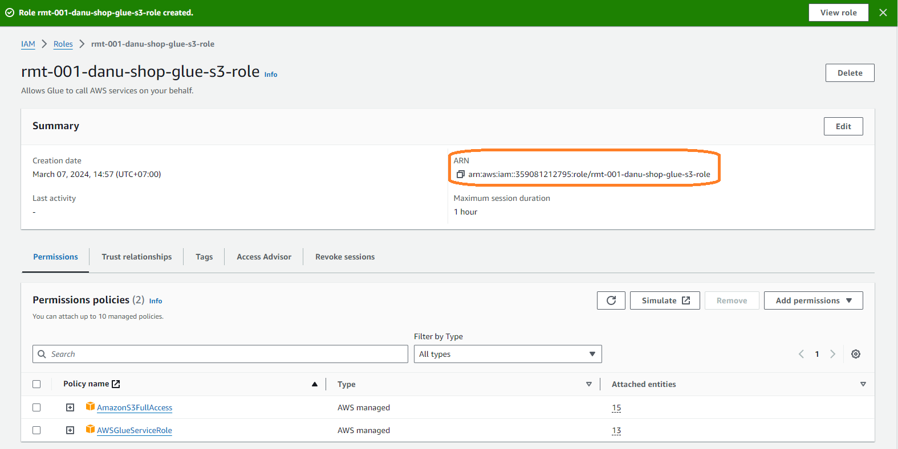
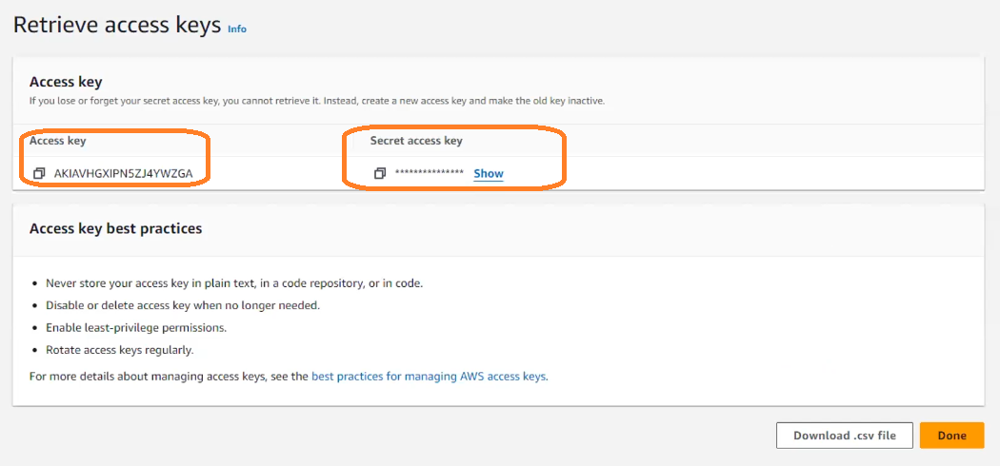

# AWS - Glue Lecture

---
# A. Create an IAM Role
1. Find and open `IAM` menu.

2. In `Access management`, click `Roles`.

3. Click `Create role`. Role digunakan jika seorang user butuh mengakses suatu service di AWS. Atau bisa juga dari suatu service berhubungan dengan service lain.

4. Config sebagai berikut :
   * `Trusted entity type` : `AWS service`
   * `Use case` : `Glue`
   * Click `Next`.
   * Pada window `Add permissions`:
     + Search `S3`, checklist `AmazonS3FullAccess`
     + Search `glue`, checklist `AWSGlueServiceRole`
     + Click `Next`.
   * Pada window `Name, review, and create`, beri nama dibagian `Role name`, contoh `rmt-001-danu-shop-glue-s3-role`, kemudian click `Create role`.
   * Click `View` di notifikasi saat rolenya sudah tercipta. Akan muncul window mengenai jenis rolenya apa saja.

5. Pada role yang sudah tercipta (`rmt-001-danu-shop-glue-s3-role`) akan terdapat 2 role : `AmazonS3FullAccess` dan `AWSGlueServiceRole`.

6. Click pada Role yang baru saja tercipta.

7. Anda akan membutuhkan ARN untuk proses berikutnya. *(Saran : Biarkan saja tab ini terbuka)*
   

---
# B. Get Access Key
1. Click profile, kemudian pilih `Security credentials`.

2. Cek bagian `Access keys`. Jika belum ada, buat dahulu Access keys.

3. Download file CSV hasil dari pembuatan Access Keys.

4. Setelah `Access keys`, terbuat Anda akan memerlukan `Access key` dan `Secret acess key` pada proses selanjutnya. *(Saran : Biarkan saja tab ini terbuka)*
   

---
# C. Download and install AWS CLI
1. Download [AWS CLI](https://aws.amazon.com/cli/).

2. Buka Terminal/Command Prompt, lalu change directory ke path dimana repository ini berada.

3. Ketikkan `$ aws` pada Command Prompt atau Terminal. Akan muncul beberapa command yang menandakan AWS CLI sudah terinstall.

4. Konfigurasi terminal/command prompt:
   * Ketikkan
     ```bash
     aws configure
     ```
   * Lalu masukkan :
     + `AWS Access Key ID` : *<sesuai dengan `Access key` dari proses B>*
     + `AWS Secret Access Key` : *<sesuai dengan `Secret access key` dari proses B>*
     + `Default region name` : isikan saja `us-east-1`
     + `Default output format` : `json`

---
# D. Create AWS S3 bucket and upload files into AWS S3 bucket

## D.1 - Create a bucket
```sh
Syntax  : $ aws s3 mb s3://$BUCKET_NAME
Example : $ aws s3 mb s3://rmt-001-danu-shop-bucket
```

## D.2 - Upload datasets into bucket
Syntax
```sh
aws s3 cp dataset/data_orders.csv s3://$BUCKET_NAME/data/data_orders/data_orders.csv 
aws s3 cp dataset/data_details.csv s3://$BUCKET_NAME/data/data_details/data_details.csv
aws s3 cp dataset/data_products.csv s3://$BUCKET_NAME/data/data_products/data_products.csv
```

Example
```sh
aws s3 cp dataset/data_orders.csv s3://rmt-001-danu-shop-bucket/data/data_orders/data_orders.csv 
aws s3 cp dataset/data_details.csv s3://rmt-001-danu-shop-bucket/data/data_details/data_details.csv
aws s3 cp dataset/data_products.csv s3://rmt-001-danu-shop-bucket/data/data_products/data_products.csv
```

---
# E. AWS Glue Crawler
## E.1 - Get ARN from Role
1. Find and open `IAM` menu.

2. In `Access management`, click `Roles`.

3. Click pada nama role yang baru saja dibuat berdasarkan langkah **A. Create an IAM Role**.

4. Copy `ARN` yang tertampil.
   

## E.2 - Run AWS Glue Crawler
Syntax
```sh
aws glue create-database --database-input "{\"Name\": \"$CATALOG_DB_NAME\"}"

aws glue create-crawler --cli-input-json "{\"Name\": \"$CRAWLER_NAME\", \"Role\": \"$YOUR_ARN\", \"DatabaseName\": \"$CATALOG_DB_NAME\", \"Targets\": {\"S3Targets\": [{\"Path\": \"s3://$BUCKET_NAME/data/data_orders/\"}]}}"

aws glue create-crawler --cli-input-json "{\"Name\": \"$CRAWLER_NAME\", \"Role\": \"$YOUR_ARN\", \"DatabaseName\": \"$CATALOG_DB_NAME\", \"Targets\": {\"S3Targets\": [{\"Path\": \"s3://$BUCKET_NAME/data/data_details/\"}]}}"

aws glue create-crawler --cli-input-json "{\"Name\": \"$CRAWLER_NAME\", \"Role\": \"$YOUR_ARN\", \"DatabaseName\": \"$CATALOG_DB_NAME\", \"Targets\": {\"S3Targets\": [{\"Path\": \"s3://$BUCKET_NAME/data/data_products/\"}]}}"

```
